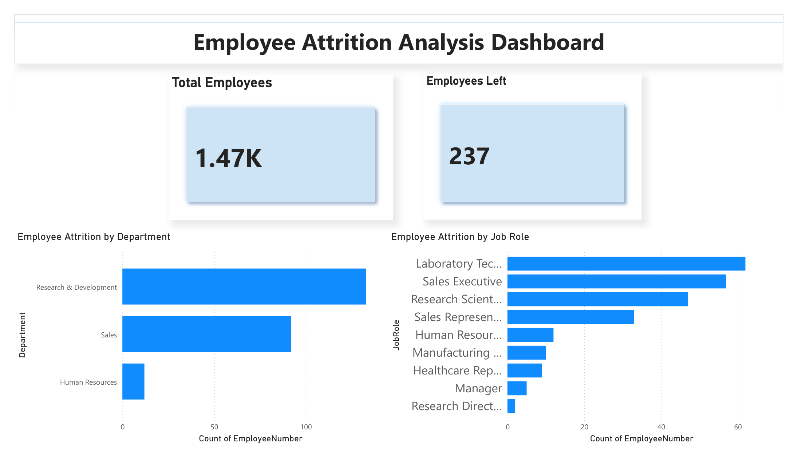
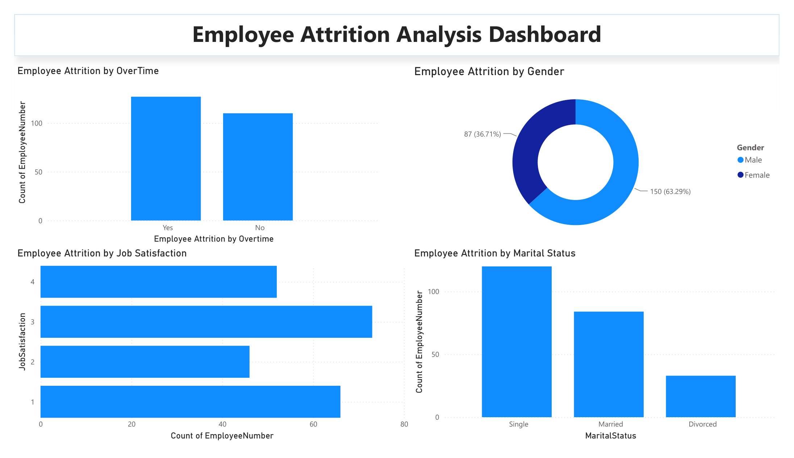
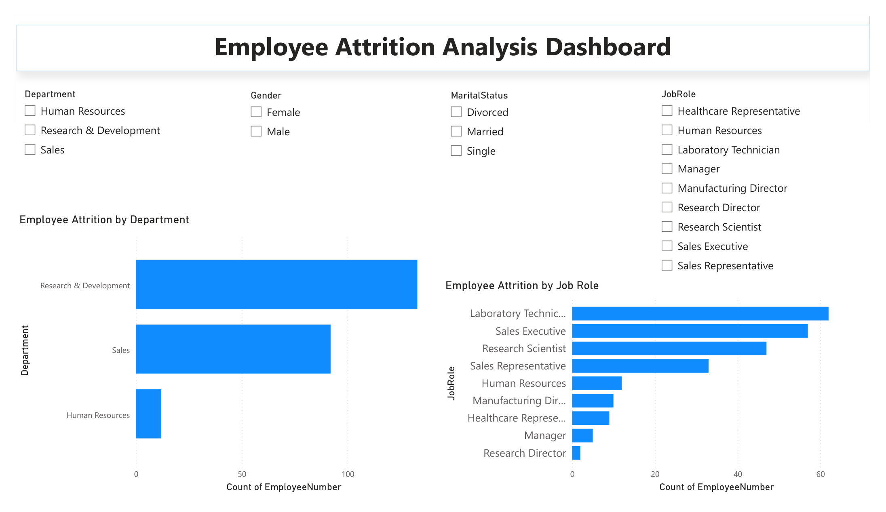

# 📊 Employee Attrition Analysis Dashboard | Power BI

## 📌 About the Project

This project focuses on analyzing employee attrition using Microsoft Power BI. The dashboard was created to explore employee turnover patterns across departments, job roles, overtime, gender, job satisfaction and marital status.

## 🎯 Objectives

- Analyze employee attrition using Power BI
- Identify departments with higher employee attrition
- Analyze attrition across different job roles
- Study the relationship between overtime and attrition
- Compare attrition based on gender and marital status
- Analyze employee attrition by job satisfaction
- Create an interactive dashboard for exploring HR data

## 🗂️ Dataset

The project uses an HR Employee Attrition dataset containing information such as:

- Department
- Job Role
- Gender
- Age
- Marital Status
- Job Satisfaction
- Monthly Income
- Overtime
- Attrition
- Years at Company
- Education
- Business Travel

The dataset contains 1,470 employee records.

## 🛠️ Tools Used

- Microsoft Power BI Desktop
- CSV / Excel dataset

## 📊 Dashboard

### Main Dashboard

### Overtime, Gender & Job Satisfaction Analysis

### Interactive Filters

## 🔍 Key Insights

- The dataset contains 1,470 employees.
- 237 employees have left the organization.
- Research & Development shows the highest employee attrition among the departments analyzed.
- Laboratory Technicians show the highest attrition among the job roles shown.
- Employees working overtime show higher attrition in the analysis.
- Attrition was also analyzed across gender, job satisfaction and marital status.

## 💡 Skills Demonstrated

- Data Analysis
- Data Visualization
- Microsoft Power BI
- Dashboard Development
- Exploratory Data Analysis
- Interactive Reporting

## 👩‍💻 Author

**Nimitha N**

BCA Student | Aspiring Data Analyst
